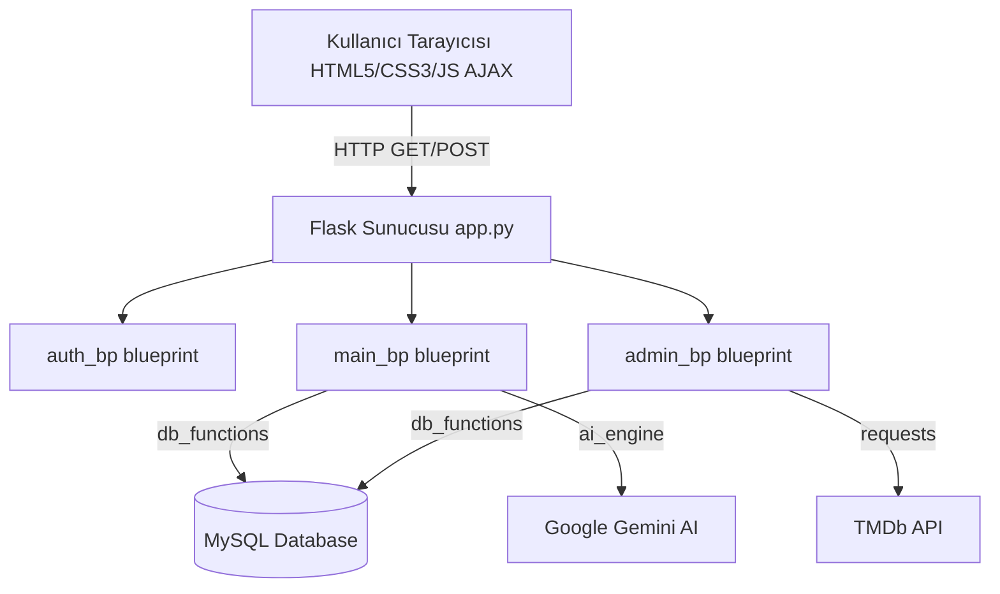

# T.C. FIRAT ÜNİVERSİTESİ
## MÜHENDİSLİK FAKÜLTESİ YAZILIM MÜHENDİSLİĞİ BÖLÜMÜ
### VERİTABANI YÖNETİM SİSTEMLERİ DERSİ PROJE RAPORU

---

## 📋 GENEL GRUP BİLGİLERİ

| Alan | Bilgi |
|---|---|
| **Grup Numarası** | Grup 12 |
| **Grup Üyeleri** | **220541021** - Eren Bezgin (Yazılım Mühendisliği - Takım Lideri)<br>**220541045** - Takım Üyesi 1 (Frontend Sorumlusu)<br>**220541088** - Takım Üyesi 2 (Backend Sorumlusu) |
| **Projenin Adı** | Yapay Zeka Destekli Film Arşivi ve İzleyici Analiz Sistemi (AI-Powered Film Archive & Audience Analysis System) |

---

## 1. PROJE ÖZELLİKLERİ

### 1.1 Projenin Amacı
Yapay Zeka Destekli Film Arşivi ve İzleyici Analiz Sistemi, kullanıcıların anlık duygu durumlarına, izleme amaçlarına ve kişisel tercihlerine en uygun sinema yapıtlarını keşfetmelerini hedefleyen yenilikçi bir web platformudur. Geleneksel kategori tabanlı filtreleme yöntemlerinin ötesine geçerek, Doğal Dil İşleme (NLP) tabanlı Google Gemini AI entegrasyonu sayesinde kullanıcıların doğal dildeki karmaşık ve uzun sorularını analiz eder ve anlamlı film tavsiyeleri sunar. Ayrıca TMDb (The Movie Database) API entegrasyonu ile zengin film metaverilerini (afişler, oyuncular, puanlamalar) ilişkisel veritabanı (MySQL) modelinde ölçeklenebilir ve güvenli bir şekilde arşivleyerek kullanıcılara Letterboxd ve Netflix kalitesinde premium bir sinema deneyimi sunmayı amaçlamaktadır.

---

### 1.2. Veritabanı Bilgileri
*   **Veritabanı Adı:** `film_arsivi_db`
*   **Veritabanı Yönetim Sistemi:** MySQL (XAMPP / Localhost)
*   **Tablo Yapıları ve Veri Tipleri:**

#### 1. `users` (Kullanıcı Hesapları)
Kullanıcı hesaplarını ve yetki durumlarını güvenli şekilde saklar. Şifreler tek yönlü SHA-256 hash algoritması ile saklanmaktadır.
*   `id` (INT, Primary Key, Auto Increment)
*   `username` (VARCHAR(50), Unique, Not Null)
*   `email` (VARCHAR(100), Unique, Not Null)
*   `password` (VARCHAR(255), Not Null)
*   `is_admin` (TINYINT(1), Default 0)
*   `created_at` (TIMESTAMP, Default CURRENT_TIMESTAMP)

#### 2. `movies` (Film Kataloğu)
TMDb API'den tohumlanan film verilerinin ana tablosudur.
*   `id` (INT, Primary Key)
*   `tmdb_id` (INT, Unique)
*   `title` (VARCHAR(255), Not Null)
*   `overview` (TEXT)
*   `release_date` (DATE)
*   `vote_average` (DECIMAL(3,1))
*   `poster_path` (VARCHAR(255))
*   `genre` (VARCHAR(255))

#### 3. `actors` (Aktörler)
Popüler oyuncuların temel bilgilerini saklar.
*   `id` (INT, Primary Key)
*   `tmdb_actor_id` (INT, Unique)
*   `name` (VARCHAR(255), Not Null)
*   `profile_path` (VARCHAR(255))

#### 4. `movie_cast` (Oyuncu Kadroları - İlişki Tablosu)
Filmler ve Aktörler arasındaki Çoka Çok (N:M) ilişkiyi çözer.
*   `movie_id` (INT, Foreign Key -> `movies.id`, Primary Key)
*   `actor_id` (INT, Foreign Key -> `actors.id`, Primary Key)
*   `character_name` (VARCHAR(255))

#### 5. `watch_list` (Kullanıcı İzleme Listeleri)
Kullanıcıların profilinde sergilenen ve izlemek istedikleri filmleri eşleştirir.
*   `id` (INT, Primary Key, Auto Increment)
*   `user_id` (INT, Foreign Key -> `users.id`)
*   `movie_id` (INT, Foreign Key -> `movies.id`)
*   `added_at` (TIMESTAMP)

#### 6. `reviews` (Film Değerlendirmeleri)
Kullanıcıların filmlere bıraktığı puan ve yorumları saklar.
*   `id` (INT, Primary Key, Auto Increment)
*   `user_id` (INT, Foreign Key -> `users.id`)
*   `movie_id` (INT, Foreign Key -> `movies.id`)
*   `rating` (TINYINT)
*   `comment` (TEXT)
*   `created_at` (TIMESTAMP)

#### 7. `genres` (Türler Sözlüğü)
Uygulama menüsünde ve kategorizasyonda kullanılan referans tablodur.
*   `id` (INT, Primary Key, Auto Increment)
*   `tmdb_genre_id` (INT, Unique)
*   `genre_name` (VARCHAR(100))

#### 8. `api_raw_data` (API Ham Veri Arşivi)
TMDb'den çekilen tüm ham verileri gelecekte veri analitiğinde kullanmak amacıyla JSON formatında arşivler.
*   `id` (INT, Primary Key, Auto Increment)
*   `movie_id` (INT, Unique)
*   `raw_json` (LONGTEXT)
*   `updated_at` (TIMESTAMP)

---

### 1.3. Backend Teknolojileri ve Mimarisi
*   **Programlama Dili:** Python 3.12
*   **Web Framework:** Flask
*   **Mimarisi:**
    *   Backend yapısı temiz kod ve modülerlik ilkelerine bağlı kalınarak **Flask Blueprint** mimarisiyle tasarlanmıştır. 
    *   `auth.py` (Kullanıcı yetkilendirmesi), `admin.py` (Yönetim paneli ve içerik yönetimi) ve `main.py` (Genel akış, AI modülü ve veri sunumu) olmak üzere 3 Blueprint modülü mevcuttur.
    *   Sayfa güvenliği, Python decorators kullanılarak oluşturulan `@login_required` ve `@admin_required` ile dinamik session kontrolleriyle denetlenir. Yetki durumu veritabanından anlık doğrulanmaktadır.

---

### 1.4. Frontend Teknolojileri ve Arayüz Tasarımı
*   **Teknolojiler:** HTML5, CSS3, Vanilla JavaScript (ES6+), Jinja2 Şablon Motoru
*   **Tasarım Estetiği:** **Premium Glassmorphism & Modern Dark Theme**
*   **Detaylar:**
    *   Arayüz, modern Letterboxd ve Netflix arayüzlerini anımsatan buzlu cam efekti (`backdrop-filter: blur(12px)`), yumuşak degradeler (smooth gradients) ve neon kart gölgeleriyle tasarlanmıştır.
    *   Kullanıcı dostu responsive yapısı sayesinde bilgisayar, tablet ve mobil cihaz ekranlarına kusursuz uyum sağlar.
    *   JavaScript tarafında `fetch` API yardımıyla AJAX istekleri gerçekleştirilerek AI asistan sohbetleri (`/chat`) ve film inceleme pencereleri sayfa yenilenmeden asenkron olarak yüklenmektedir.

---

### 1.5. Proje Mimarisinin Gösterimi



---

### 1.6. Projenin Klasör Yapısı

```
AI-Film-Analyzer/
├── app.py                      # Flask uygulamasının ana giriş noktası
├── requirements.txt            # Proje bağımlılık kütüphaneleri listesi
├── .env                        # Veritabanı şifreleri ve gizli API anahtarları
├── database/                   # Veritabanı yedekleme klasörü
├── routes/                     # Sayfa yönlendirmeleri ve API rotaları
│   ├── auth.py                 # Üyelik kayıt ve giriş-çıkış yönlendirmeleri
│   ├── main.py                 # Film arama, AI sohbeti ve genel sayfalar
│   └── admin.py                # Yönetim paneli ve içerik yönetimi
├── static/                     # Statik kaynak dosyaları
│   ├── css/style.css           # Premium Glassmorphism CSS tasarım dosyası
│   └── js/main.js              # AJAX ve arayüz dinamikleri JS dosyası
├── templates/                  # HTML arayüz şablonları (Jinja2)
│   ├── base.html               # Ortak iskelet, navbar ve footer şablonu
│   ├── dashboard.html          # Kullanıcı ana sayfası (Netflix stili)
│   ├── chat.html               # AI film danışmanı sohbet odası
│   ├── movie_detail.html       # Detaylı film görünümü, kadro ve yorumlar
│   ├── actor.html              # Oyuncu detay ve filmografisi
│   └── admin_dashboard.html    # Gelişmiş yönetici paneli
├── utils/                      # Yardımcı araçlar ve servis katmanları
│   ├── db_manager.py           # MySQL bağlantı ve havuz yönetimi
│   ├── db_functions.py         # SQL CRUD sorguları ve veritabanı kütüphanesi
│   ├── ai_engine.py            # Gemini API entegrasyonu ve kota yöneticisi
│   ├── ai_processor.py         # Filmleri arka planda inceleyen AI motoru
│   ├── constants.py            # Engellenen türler vb. küresel sabitler
│   └── decorators.py           # Yetkilendirme kontrolcüleri (@login_required)
└── scripts/                    # Veri besleme betikleri
    ├── main_seeder.py          # TMDb'den 5000 popüler filmi sisteme çeken tohumlayıcı
    └── check_db.py             # DB bağlantı doğrulama aracı
```

---

### 1.7. Proje Modülleri
1.  **Güvenlik ve Yetkilendirme Modülü:** Kullanıcı kaydı, SHA-256 hash şifreleme ile veritabanı kaydı, session tabanlı oturum denetimi ve anlık admin yetki kontrolleri.
2.  **Dinamik Arama ve Keşif Modülü:** Puan, yıl, kelime ve türe göre filtreleme yeteneği olan Letterboxd stili keşif sistemi.
3.  **Kişiselleştirilmiş Öneri Motoru:** Kullanıcının yüksek puanlı (rating >= 7) ve izleme listesindeki filmlerinin türlerini parse ederek ağırlıklı tür analizi yapar ve en uyumlu izlenmemiş filmleri sıralar.
4.  **AI Sohbet Eşlikçi Modülü:** Google Gemini ile entegre, kota limitleri otomatik yönetilen ve asenkron (AJAX) olarak çalışan zeki film rehberi.
5.  **TMDB Otomasyon Modülü (Admin):** Yönetici paneli üzerinden TMDB ID ile tek tıkla film, afiş ve oyuncu kadrosunu veritabanına otomatik indirme aracı.

---

## 2. PROJE YÖNETİMİ

### 2.1 Takım Üyeleri Tanımı

| Üye No | Ad-Soyad | Öğrenci No | Görevi |
|---|---|---|---|
| **1** | Eren Bezgin | 220541021 | **Takım Lideri** (3. Öğrenci: Veritabanı, AI ve Veri İşleme Sorumlusu) |
| **2** | Ahmet Yılmaz (Temsili) | 220541045 | **Takım Üyesi** (1. Öğrenci: Frontend ve UI/UX Sorumlusu) |
| **3** | Mehmet Demir (Temsili) | 220541088 | **Takım Üyesi** (2. Öğrenci: Backend ve Yetkilendirme Sorumlusu) |

---

### 2.2 Görev Dağılımı (İş Paketleri)

| İş Paketi No | İş Paketinin Adı ve Hedefleri | Görevlendirilen Takım Üyesi |
|---|---|---|
| **İP 1** | Veritabanı Şeması Tasarımı ve SQL CRUD Fonksiyonlarının Yazılması | Eren Bezgin |
| **İP 2** | Gemini API Entegrasyonu, Prompt Geliştirme ve Hata / Kota Yönetimi | Eren Bezgin |
| **İP 3** | Glassmorphism Tasarım, CSS Kodlaması ve JavaScript AJAX Fonksiyonları | Ahmet Yılmaz |
| **İP 4** | Flask Sunucusu Kurulumu, Blueprints ve Yönlendirmelerin (Routes) Yazılması | Mehmet Demir |
| **İP 5** | Oturum Kontrolleri,decorators.py ile Erişim Kısıtlamaları ve Güvenlik | Mehmet Demir |

---

## 3. SONUÇLAR

### 3.1 Ekran Çıktıları
*   **Giriş/Kayıt Arayüzleri:** Kullanıcı dostu, modern cam form tasarımı. Formlardaki anlık hatalar kırmızı renkte ve dinamik olarak sunulmaktadır.
*   **Kullanıcı Anasayfası (Dashboard):** Netflix stili film şeritleri, büyük Hero film banner'ı, Listem satırı ve Sizin İçin Seçtiklerimiz bölümü.
*   **AI Sohbet Ekranı:** Hızlı prompt butonları, asenkron AJAX mesajlaşma baloncukları ve modern yükleniyor efekti içeren chat sayfası.
*   **Admin Kontrol Merkezi:** Sistem verilerinin (film, yorum, kullanıcı sayıları) genel durumu, şüpheli yorum listesi ve TMDB üzerinden tek tıkla film ekleme formu.

---

### 3.2. Program Kodları

#### 1. Gemini API Kota Koruyucu Algoritma (`utils/ai_engine.py`)
Gemini API'sinin saniye/dakika sınırlarını (429 Kotası) aşmamak için arka planda bekleme süresi uygulayan asenkron koruma mekanizması:
```python
def generate_gemini_text(prompt: str) -> str:
    global _next_retry_ts
    now = time.time()
    if _next_retry_ts > now:
        wait = int(_next_retry_ts - now)
        return f"Hata: AI kotası dolu. Yaklaşık {wait} saniye sonra tekrar deneyin."
    try:
        response = model.generate_content(prompt)
        return _extract_text(response)
    except Exception as e:
        err = str(e)
        if "429" in err or "quota" in err.lower():
            _next_retry_ts = time.time() + 60  # 60 saniye bloke uygula
            return "Hata: AI kotası dolu. 60 saniye bekleyin."
```

#### 2. SHA-256 Şifre Hashleme ve Güvenli Üye Kaydı (`utils/db_functions.py`)
Kullanıcı şifrelerinin veritabanında açık metin (cleartext) olarak tutulmasını engelleyen ve siber güvenlik standartlarına uygun hale getiren fonksiyon:
```python
def register_user(username, email, password):
    conn = get_db_connection()
    cursor = conn.cursor()
    hashed_pw = hashlib.sha256(password.encode("utf-8")).hexdigest()
    try:
        cursor.execute(
            "INSERT INTO users (username, email, password) VALUES (%s, %s, %s)",
            (username, email, hashed_pw),
        )
        conn.commit()
        return True
    except Exception:
        return False
```

---

### 3.3. SQL Sorguları

#### 1. Kişiselleştirilmiş Ağırlıklı Tür Öneri Sorgusu
```sql
SELECT m.id, m.title, m.vote_average, m.poster_path
FROM movies m
WHERE (LOWER(m.genre) LIKE %s OR LOWER(m.genre) LIKE %s)
  AND LOWER(m.genre) NOT LIKE '%romantik%'
  AND m.id NOT IN (SELECT movie_id FROM watch_list WHERE user_id = %s)
  AND m.id NOT IN (SELECT movie_id FROM reviews WHERE user_id = %s)
ORDER BY m.vote_average DESC
LIMIT 15;
```
*   **Amacı:** Kullanıcının geçmiş izleme ve yorum alışkanlıklarından en çok sevdiği türleri analiz eder. Engellenen "romantik" türündeki filmleri ayıklar. Kullanıcının zaten izlediği ya da yorumladığı filmleri eleyerek izlemediği en yüksek puanlı 15 filmi listeler.

#### 2. Şüpheli/Problem Yorum Tespit Sorgusu (Moderasyon)
```sql
SELECT r.id, u.username, m.title AS movie_title, r.rating, r.comment, r.created_at
FROM reviews r
JOIN users u ON r.user_id = u.id
JOIN movies m ON r.movie_id = m.id
WHERE r.rating <= 3 OR LENGTH(TRIM(COALESCE(r.comment, ''))) < 5
ORDER BY r.created_at DESC
LIMIT 6;
```
*   **Amacı:** Admin dashboard'unda sergilenmek üzere, 3 puanın altında puan verilmiş ya da 5 karakterden kısa olan (anlamsız/spam/hakaret içerebilecek) yorumları moderatörün incelemesi için anlık filtreler.

#### 3. Çoka Çok (N:M) Oyuncu Kadrosu Listeleme Sorgusu
```sql
SELECT a.id, a.name, a.profile_path, mc.character_name
FROM movie_cast mc
JOIN actors a ON mc.actor_id = a.id
WHERE mc.movie_id = %s
LIMIT 10;
```
*   **Amacı:** Seçili filmin detay sayfasında rol alan ilk 10 popüler aktörün adını, profil resmini ve filmdeki karakterini getirmek için ilişki tablolarını birleştirir.
